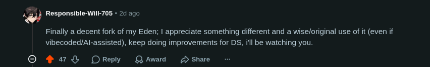

<p align="center">
  
</p>

<h1 align="center">Eden Duo</h1>

<p align="center">
  A Nintendo Switch emulator for Android dual-screen handhelds, with live companion screens on the second display.
</p>

---

Eden Duo is a fork of the [Eden](https://git.eden-emu.dev/eden-emu/eden) Switch emulator for Android devices with two screens, such as the AYN Thor. The game runs on the top screen as usual. The bottom screen shows a touch **companion** for the game you are playing: maps, party and inventory menus, status, and more, all driven by the running game's live state.

Companions are separate, installable **`.dsmod.zip` packages**, one per game, so a companion can be updated without updating the emulator. This repository holds the emulator source code and the Eden Duo APK. Companion packages, their documentation and screenshots live in **[Eden Duo Companions](https://github.com/igawa6/eden-duo-companions)**.

## Supported Games

The Animal Crossing: New Horizons, Fire Emblem: Three Houses and The Binding of Isaac companions require Eden Duo 1.1.0 or newer.

| No | Game | Title ID | Patch Version | Contributor/Supporter |
|---:|------|----------|---------------|:---------:|
| 1 | [Persona 5 Royal](https://github.com/igawa6/eden-duo-companions#persona-5-royal) | `01005CA01580E000` | 1.0.2 | 🥇<sup>1</sup> |
| 2 | [Metroid Dread](https://github.com/igawa6/eden-duo-companions#metroid-dread) | `010093801237C000` | 2.1.0 | |
| 3 | [The Legend of Zelda: Link's Awakening](https://github.com/igawa6/eden-duo-companions#the-legend-of-zelda-links-awakening) | `01006BB00C6F0000` | 1.0.1 | |
| 4 | [Mario Kart 8 Deluxe](https://github.com/igawa6/eden-duo-companions#mario-kart-8-deluxe) | `0100152000022000` | 4.0.0, 3.0.3 (also with CTGP-DX v1.1.1) | |
| 5 | [Super Mario Bros. Wonder](https://github.com/igawa6/eden-duo-companions#super-mario-bros-wonder) | `010015100B514000` | 1.2.1 | ⭐<sup>1</sup> |
| 6 | [Animal Crossing: New Horizons](https://github.com/igawa6/eden-duo-companions#animal-crossing-new-horizons) | `01006F8002326000` | 3.0.3 | 🥇<sup>2</sup> |
| 7 | [Fire Emblem: Three Houses](https://github.com/igawa6/eden-duo-companions#fire-emblem-three-houses) | `010055D009F78000` | 1.2.0 |  |
| 8 | [The Binding of Isaac: Afterbirth+ and Repentance DLC](https://github.com/igawa6/eden-duo-companions#the-binding-of-isaac-afterbirth-and-repentance-dlc) | `010021C000B6A000` | 1.7.9b | 🥇<sup>3</sup> |

<sup>1</sup> 🥇 Thanks to [u/gymgooner123](https://www.reddit.com/user/gymgooner123), who commissioned the Persona 5 Royal companion.

<sup>1</sup> ⭐ Credit to [u/Far_Entrepreneur_246](https://www.reddit.com/user/Far_Entrepreneur_246), creator of Super Mario Wonders companion. Support him on [Patreon](https://www.patreon.com/cw/KalebPowell).

<sup>2</sup> 🥇 Thanks to [MsMeriBerry](https://ko-fi.com/W5J3253HW9), who commissioned the Animal Crossing: New Horizons companion.

<sup>3</sup> 🥇 Thanks to [Armando Chacon](https://ko-fi.com/U3I527XBIL), who commissioned The Binding of Isaac: Afterbirth+ and Repentance DLC companion.

Compatibility is intentionally strict. Each companion is written for exact game builds and checks the running build before it loads. On any other version it does not load and shows a notice, instead of reading memory it does not understand.

Details, screenshots and downloads for each companion: **[Eden Duo Companions](https://github.com/igawa6/eden-duo-companions)**.

## Features

- **Second-screen companion.** The game on the main screen, and a touch companion page on the second display.
- **Live game state.** Companions read the running game's memory every frame. There are no save-file snapshots and no polling delays.
- **Installable packages.** Add a companion from the game's *Add-ons* menu with its `.dsmod.zip`. Packages are validated (title, build, file layout and module checksums) before they are installed.
- **Native companion modules.** A package can carry a small native module for games whose data is too complex for a declarative manifest. Modules talk to the emulator through a small, versioned C interface and never ship inside the APK.
- **Touch that feels native.** Taps, press-and-hold gestures, drag and drop, animated page and layout changes, and haptic feedback on the second screen.
- **Second screen your way.** Swap the screens, stretch the companion, or open another app on the second screen for games without a companion.
- **Built for handhelds.** Change-driven partial redraws, tile-based texture uploads and an optional GPU compositor keep the second screen at full frame rate without costing the game frames.

## What's New

See the [changelog](CHANGELOG.md).

## Requirements

- Android 13 or newer, arm64 (`arm64-v8a`).
- A device with a second display (developed and tested on the AYN Thor).
- Your own legally obtained game dump, the matching update, and your console's keys and firmware.
- The exact game version listed in [Supported Games](#supported-games).

## Install

1. Download the latest `EdenDuo-*.apk` from [Releases](https://github.com/igawa6/eden-duo/releases) and install it.
2. Set up the emulator as usual: keys, firmware, and your games folder.
3. Download a companion package from [Eden Duo Companions](https://github.com/igawa6/eden-duo-companions).
4. In Eden Duo, long-press the game, open **Add-ons** and tap **Install**. In the **Content type** dialog choose **Dual screen mods**, tap **OK**, then select the `.dsmod.zip` file. The companion appears in the Add-ons list as `<Name>-<version>`, for example `MetroidDreadDS-1.0.0`.
5. Launch the game. The companion appears on the second screen once the game reaches gameplay.


Eden Duo uses its own app ID (`dev.igawa6.edenduo`), so it installs alongside other Eden builds and keeps separate data.

## Launching from a Frontend

| Frontend | Setup |
|----------|-------|
| [CocoonFE](https://github.com/inssekt/CocoonFE) | Built in, thanks to [cream-neapolitan](https://github.com/cream-neapolitan). In Cocoon, open **Settings → Library & Data → Refetch Platforms**. Then, for each game you want on Eden Duo, open the game's settings and set **Player Override** to **Eden Duo**. |
| [ES-DE](https://es-de.org) (Android) | Copy [`es-de/es_systems.xml`](dist/frontends/es-de/es_systems.xml) and [`es-de/es_find_rules.xml`](dist/frontends/es-de/es_find_rules.xml) into `ES-DE/custom_systems/` and restart ES-DE. **Eden Duo (Standalone)** becomes the default Switch emulator. |

The ES-DE files are the upstream files from [es-de-android-custom-systems](https://github.com/GlazedBelmont/es-de-android-custom-systems), with only the Eden Duo entries added.

## Second Screen

Second-screen options are in **Settings → Graphics → Second Screen**. Each game can also have its own values: long-press the game, open **Settings → Graphics → Second Screen**. A game's own value overrides the global one. Long-press a setting there to reset it to the global value.

| Setting | Options | What it does |
|---------|---------|--------------|
| **Swap Screens** | On / Off | Switch which display runs the game and which shows the companion. Choose the layout that suits your dual-screen handheld, including Retroid or AYANEO Android devices with an extra display. Works from the game list and from frontends. |
| **Companion Ratio** | Fit (default) / Stretch | Fit keeps the companion's shape and adds bars if needed. Stretch fills the screen. |
| **No Companion** | Icon (default) / Black / Off / App | What the second screen does for a game without a companion. Icon shows the game icon dimmed on black. Black leaves it black. Off opens no window, so the second screen is free for other apps. App launches your chosen guide app, browser, media player or another installed app on the second/bottom screen when the game starts; pick it in the **App** row below, with search. Until you choose one, App works like Off. |

- No Companion can be changed while a game runs. It applies when you return to the game (Icon and Black from the next start).
- With Swap Screens on and a game that has no companion, Off (or App with no app chosen) keeps the game on the main screen.

### Set Swap Screens for a Game

Put gameplay on the display you prefer and keep the companion within easy reach on the other. This is especially useful when a Retroid or AYANEO Android handheld's extra display gives you a different layout from a built-in dual-screen device.

1. In the game list, **long-press the game** and open **Settings**.
2. Open **Graphics → Second Screen**.
3. Set **Swap Screens** to **On** to put the game on the second display and the companion on the main display. Set it to **Off** to keep the game on the main display.
4. Start the game from Eden Duo or your frontend. It uses that game's saved screen layout.

This choice is **per game**. To use one layout as the default, change **Settings → Graphics → Second Screen → Swap Screens** from Eden Duo's main settings. Long-press the per-game setting to restore the global default.

### Open Another App on the Bottom Screen for a Game

A game without a companion can still make good use of both screens. Keep a walkthrough in a guide app or browser, play media, or open another installed app on the second/bottom screen alongside the game.

1. In the game list, **long-press the game** and open **Settings**.
2. Open **Graphics → Second Screen**.
3. Set **No Companion** to **App**.
4. Open the **App** row and search for the installed guide app, browser, media player or other app you want to launch.
5. Start the game. Eden Duo launches the chosen app on the second/bottom display for games without a companion. In a browser, open the guide you want to use.

The app choice is **per game**: choose a guide app for one game and a media player for another. You can also set a default from Eden Duo's main **Settings → Graphics → Second Screen** settings. Long-press a per-game setting to inherit the global choice.

For a quiet screen, choose **Icon** or **Black**; choose **Off** to leave it available for apps you open yourself. Icon/Black changes during play take full effect on the next game start.

## Contribute to Another Game

Eden Duo is not limited to the games above. Anyone can write a companion for another game and ship it as a `.dsmod.zip`, without changing or rebuilding the emulator. Runtime 18 gives you pages declared in JSON, plus an optional native module for game data that JSON cannot reach. AI assistance is welcome: let an assistant do the repetitive reverse engineering, then check every value against the game's own screens.

Start here: [Contribute to Another Game](https://github.com/igawa6/eden-duo-companions/blob/main/docs/CONTRIBUTE.md)

Module sources live in this repository under [`src/core/mods/modules/`](src/core/mods/modules/).

## Build

Requirements: JDK 17, Android SDK 36, NDK 28.2.13676358, CMake 3.31.6.

```sh
cd src/android
export ANDROID_HOME=$HOME/Android/Sdk
export ANDROID_NDK_ROOT=$ANDROID_HOME/ndk/28.2.13676358

# Local test build ("Eden Duo Dev", installs beside the release build)
./gradlew assembleMainlineRelWithDebInfo

# Release build, signed with your own key
export ANDROID_KEYSTORE_FILE=/path/to/release.jks
export ANDROID_KEYSTORE_PASS=...
export ANDROID_KEY_ALIAS=...
./gradlew assembleMainlineRelease
```

The APK is written to `src/android/app/build/outputs/apk/mainline/<buildType>/`.

A desktop build (`eden-cli`) is supported for companion development. It can run a companion headlessly and capture both screens.

## How It Works

The dual-screen runtime lives in `src/core/mods/`. Each tick it:

1. Samples the game: memory points, pointer chains, and the companion's native module.
2. Evaluates derived values and handles touch input.
3. Redraws only what changed on the companion page.
4. Hands the page to the second display.

The package format, the module interface and the method used to build a companion for a new game are documented in the [Eden Duo Companions docs](https://github.com/igawa6/eden-duo-companions/tree/main/docs).

## Game Assets

Eden Duo and its companions ship **no game assets**. Companion art and text are decoded at runtime from the player's own game files. Game data, keys, firmware and ROMs must not be uploaded to this repository or its releases.

## AI Assistance

Eden Duo was developed with AI assistance. The dual-screen runtime, the companion modules and the reverse engineering of each game were written with an AI coding assistant, then reviewed, tested and verified on real hardware.

If anything is wrong with Eden Duo, report issues here rather than to upstream Eden.

## Kind Words from Eden Dev



## Credits and License

Eden Duo is based on the open-source [Eden](https://git.eden-emu.dev/eden-emu/eden) emulator and its predecessors.

Eden Duo is an independent fork. It is not affiliated with or endorsed by the Eden project or Nintendo. All trademarks belong to their respective owners.

Eden Duo is free software, released under the [GNU General Public License v3.0](LICENSE.txt).
